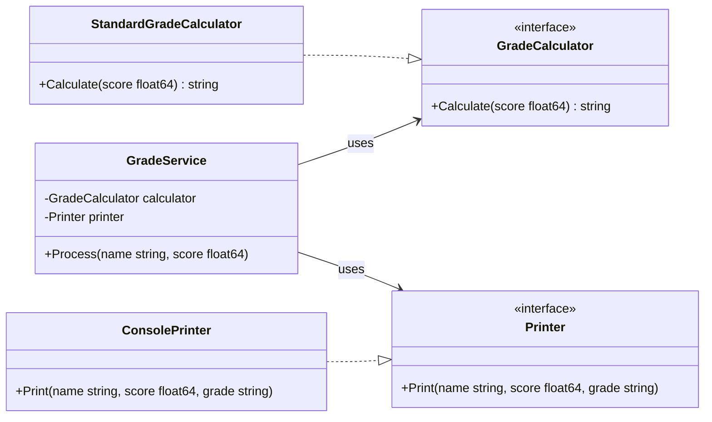

# Grade Calculator (Go)

A small example Go program that demonstrates clean design using interfaces and dependency injection.

The program defines a `GradeCalculator` and `Printer` interface, provides concrete implementations (`StandardGradeCalculator` and `ConsolePrinter`), and a `GradeService` which uses them to compute and print student grades.



Files
- `main.go` — the application entrypoint and example usage
- `go.mod` — module definition

Build & Run

From the repository root (where `go.mod` and `main.go` live):

```sh
# build the binary
go build -o gradecalc .

# run the built program
./gradecalc

# or run without building
go run main.go
```

Example output

When run, the program prints output similar to:

```
===============================================
|            Grade Calculator                 |
===============================================
Student: Jeerasak | Score: 85.00 | Grade: A
Student: Ananta   | Score: 75.00 | Grade: B
Student: Game     | Score: 65.00 | Grade: C
Student: Jo       | Score: 65.00 | Grade: C
Student: Pong     | Score: 45.00 | Grade: F
===============================================
```

Design notes

- Uses interfaces to decouple grading logic from output logic.
- `GradeService` composes a `GradeCalculator` and a `Printer`, making it easy to swap implementations for tests or different outputs (e.g., file, HTTP, or GUI).

License

This repository has no explicit license. Add one (for example, `LICENSE` with MIT) if you want to permit reuse.
